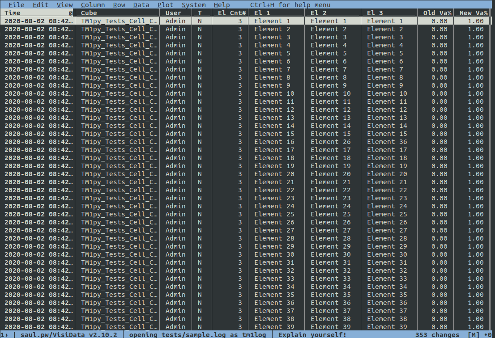

# TM1 Transaction Log plugin for Visidata

Explore tm1 transaction logs with [Visidata](https://visidata.org).

## Installation

Copy `vd_tm1log.py` from the repo to `~/.visidata/plugins`

Add `import plugins.vd_tm1log` to `~/.visidatarc`

Generic instructions for installing plugins can be found [here](https://www.visidata.org/docs/plugins/).

## Basic Usage

Open a tm1 transaction log file with:

```sh
vd tm1s20200802093541.log -f tm1log
```

Or open multiple logs at once:

```sh
vd tm1s20200802093541.log tm1s202009026084529.log -f tm1log
```

Or a range, e.g. December 2020:

```sh
vd tm1s202012*.log -f tm1log
```

This will parse the log file(s) and show the cube changes in a custom Visidata sheet for each file.




You then get all the power of Visidata at your fingertips.

E.g:

* Sort columns (cubes, values, elements etc) with `[` and `]`
* Hide columns you're not interested in with `-`
* Showing the number of changes by e.g. user or cube by selecting a column and hitting `F`
* Select all rows matching where the value in the col matches the current selected cell with `,`
* Open all selected rows in a new sheet with `"` to help you zero in on a specific change

And much more, see the [Visidata cheat sheet](https://jsvine.github.io/visidata-cheat-sheet/en/).


## Filtering at Load Time

These log files can often be huge but if you know what you're looking for, you can asynchronously sift through a huge number of rows by selecting only the records you want.

**Note:** string filters (e.g. cube and user) are applied case insensitively to mirror tm1's behaviour.


### Control Cubes

By default, control cubes are suppressed. You can include them with the `tm1-ctrl` option:

```sh
vd tm1s20200802093541.log -f tm1log --tm1-ctrl=true
```

### Filtering by Cube

Filter for a specific cube with `tm1-cube` option:

```sh
vd tm1s20200802093541.log -f tm1log --tm1-cube=sales
```

Filtering by a specific cube implies `tm1-ctrl` allowing you to search for a specific attribute cube etc.

### Filtering by User

Filter for a specific user with `tm1-user` option:

```sh
vd tm1s20200802093541.log -f tm1log --tm1-user=alexander.sutcliffe
```

### Filtering by datatype

You can also choose to only include `N` or `S` values:

```sh
vd tm1s20200802093541.log -f tm1log --tm1-dt=n
```

Again, it's case insensitive, either `N` or `n` will work.

### Combining Filters

You can also combine filters:

```sh
vd tm1s20200802093541.log -f tm1log --tm1-user=alexander.sutcliffe --tm1-cube=sales
```
